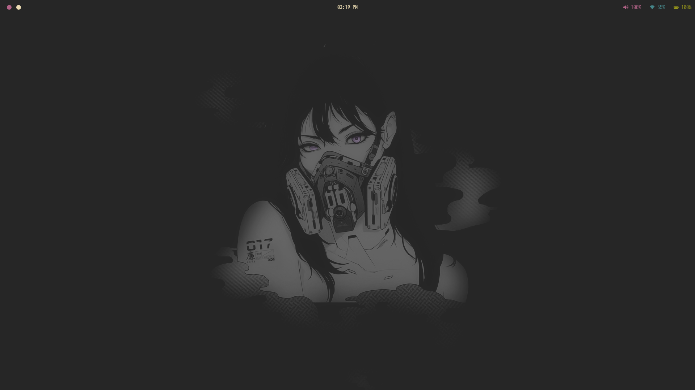
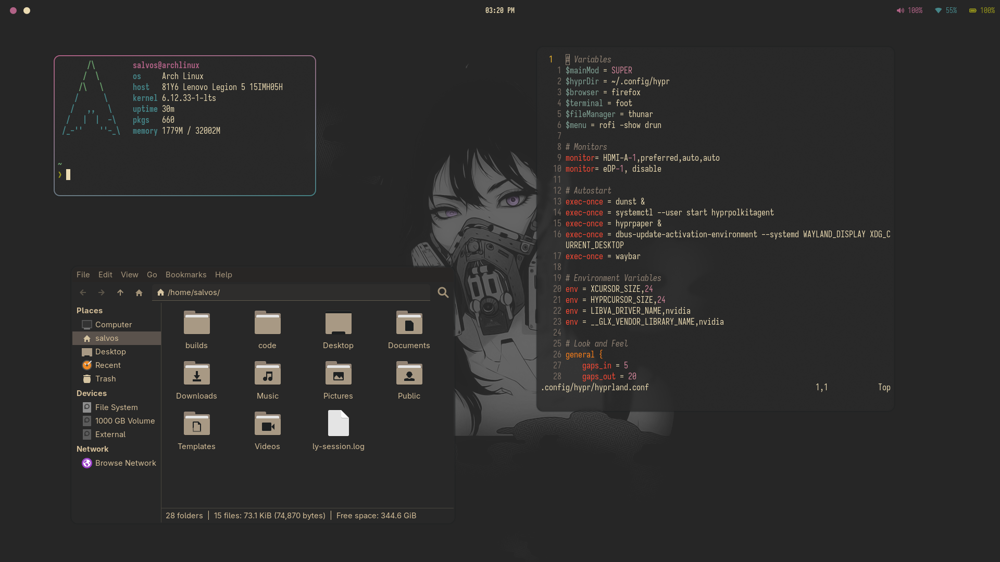

# Hyprland Dotfiles





## Installation

I'd recommend reading the install guide at [Hyprland](https://wiki.hypr.land/Getting-Started/Installation/) for getting a base configuration.

If you are using an NVIDIA GPU I'd also recommend reading the [NVIDIA](https://wiki.hypr.land/Nvidia/) specific tweaks though my setup is for an NVIDIA system.

**It is recommend to use the provided install.sh the rest of this guide is for a manual install**

Simply clone the repository and run the installation script:

```
git clone https://github.com/Salvos-Dev/hypr.git ~/.config/

./install.sh
```

## Installation (Manual)

This guide assumes you're using Arch Linux, these configuration while they *can* work on other distributions Arch Linux is the intended platform.

After you have [Hyprland](https://hypr.land) installed, you'll need the following dependencies:

- Iosevka Nerd Font (Font)

- Foot (Terminal Emulator)

- Zsh (Shell)

- Starship (Prompt)

- Waybar (Status bar)

- Hyprpaper (Wallpaper Selection)

- Hyprshot (Screenshots)

- Hypr Polkit Agent (Authentication)

- XDG Desktop Portal Hyprland (Authentication)

- Rofi Wayland (Menu/Launcher)

- Neovim (Editor)

- Thunar (File Manager)

- Firefox (Web Browser)

On Arch Linux you can run the following command:

`sudo pacman -S --needed - < pkglist.txt`

For everything to work correctly you need to make some symbolic links for all the configurations to load:

```
ln -s ~/config/hypr/foot/foot.ini ~/.config/foot/foot.ini

ln -s ~/config/hypr/nvim/init.lua ~/.config/nvim/init.lua

ln -s ~/config/hypr/nvim/lua ~/.config/nvim/lua

ln -s ~/.config/hypr/rofi/config.rasi ~/.config/rofi/config.rasi

ln -s ~/.config/hypr/waybar/style.css ~/.config/waybar/style.css

ln -s ~/.config/hypr/waybar/config.jsonc ~/.config/waybar/config.jsonc

ln -s ~/.config/hypr/zshrc ~/.zshrc
```

And that's it! Just login to Hyprland and you'll have a funtional and beautiful Hyprland configuration.
